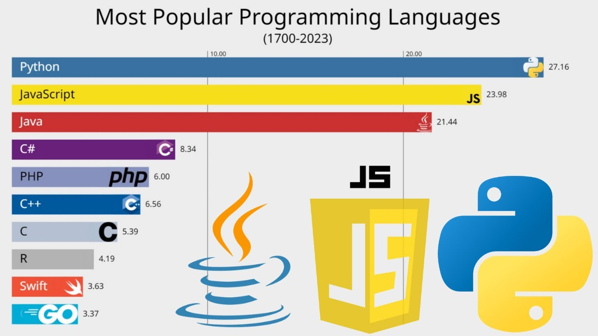

# 1.1 Welcome to Python

Computers don't speak English, so we need some kind of language to talk to them. Programming languages provide that for us.

Python is a great language to start with, as it's very popular among programmers, especially in the world of data. Here's a random chart that probably isn't accurate but is cute to look at.

So let's get started!

## Install Anaconda Navigator

Anaconda Navigator is a free program that is often recognized as one of the best ways to learn, write, and execute Python. You'll see why once you get the hang of it.

Download Anaconda Navigator using [this link](https://www.anaconda.com/download/success) and choose your operating system. Once that's downloaded, follow the installer instructions. You can optionally create an account with Anaconda. Finally, let's head into the magical world of Python.

Open your fresh new Anaconda Navigator. You may be assaulted by a login request, but can ignore that if you didn't create an account.

On your Dashboard, find "Jupyter Notebook" -- it should already be installed. Click "Launch" inside that pane. After a few moments, it should open your default browser at a location looking something like this:

> http://localhost:8888/tree

Click on Documents, then in the upper right, click "New." Choose "Folder" and create a new folder. Now select the checkbox to the left of that new folder (probably named "Untitled Folder") and then click "Rename" at the top, and enter "data-learn". Once that is complete, click that new "data-learn" folder. Now choose "New" and "Python 3 (ipykernel)".

**Great Success! You just created your first Jupyter Notebook.**

(It is suggested to choose File -> Rename... and rename your notebook something like "Episode1", but if you're more of an Untitled person, go for it.)

## Python Basics: My First For Loop

Typically, when learning to program, the first code you'll write is something that will display the words "Hello World." In our case, let's buck the trend and write something way cooler.

You should have your .ipynb file open in your Jupyter Notebook instance. (If something happened, go back to Anaconda Navigator, launch Jupyter Notebook, and open the file again. It should be in your Documents/data-learn directory.)

In Notebooks, we write code in cells and then tell the computer which cells to run. First, let's write something called a "`for` loop."

_`for` loops_ are super important in programming languages. It allows the computer to go through a series of items and perform an action.

This is similar to unpacking a box after moving day. You first open the box and see what's inside. Then, item-by-item, you do something to that item. Maybe you put a flower vase on a table. Then you put a plate in the kitchen cabinet. A magnet goes on the fridge.

Similarly, you tell the computer what to do with each item. In our case, our "box" is going to be a word, and each "item" is going to be a letter in that word.

We start a `for` loop very easily -- just type the word `for`. Then we create a name for the items we expect. In our case, we'll be looking at each letter of the word, so we'll just use `letter`.

Next, we use the keyword `in` so the computer knows we're about to give it the box where the items are. For us, that will be a word -- let's do `'sup peeps'`. Notice that any text needs apostrophes so computers know we're talking about text and not special computer commands or numbers. A colon ends the `for` loop syntax. So your first line should look like this:

> `for letter in 'sup peeps':`

Finally, we'll tell the computer what to do with each item. We could do some crazy transformations or math calculations or just about anything else -- but for now, let's just have it print each letter below the cell. Remember we're calling each letter `letter` (convenient, right?). So you can tell the computer to "`print`" it out like this:

        print(letter)

The `print` keyword tells the computer to print, and inside the parentheses tells it specifically what to `print`. Notice the tab -- this is something called a "code block" and you'll learn about it later. So, all put together:

    for letter in 'sup peeps':
        print(letter)

Click the "`> Run`" button in your Notebook menu and it should print out the letters, one-by-one, beneath the cell.

Congrats! You just wrote and executed your first runnable code. Not some stupid "Hello world" that the rest of your engineering buddies did. You did one of the more complicated pieces of programming in your first go. Looks like you're going places!

## Assignment

- In your new Notebook (or "script"), change the name of `letter` to `ltr`. Make sure you change both places that you use it. Try to run it and see if it changes anything. Why or why not?
