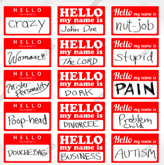

# 1.2 Variables and Other Harmless Monsters

You saw a variable in the last scene. `letter` was a variable we were using to represent each of the letters in the text string `'sup peeps'`.

Variables are like name tags. You know how every time people are given name tags, there is some idiot who puts an unoriginal fake name like "Slim Shady?"

Well, think of a variable like that name tag. It's a way of identifying something by a random name you come up with. For example, if I want to do fruit math, I could do it:

    apple = 1
    orange = 2
    math_answer = apple + orange

Wanna take a quick guess what `math_answer` is going to be?

    print(math_answer)

Let's run this in your Notebook, in a new cell. There may already be a new cell below your first one. If not, you have two options:

 1. Click your first cell, then press the 'Esc' button, then click the 'B' button. Another cell should appear below the first.
 2. Go to the 'Insert' menu, then click 'Insert Cell Below.'
 
 If you run this in your Notebook, surprise! You get `3` printed in the output. Shocker, I know.

Notice that we just chose some random names for all these variables. You get to choose whatever name you want for them, as long as there are no spaces (typically an underscore `_` is used instead). It's best practice to use a name that makes sense in your code's context. Fruit math typically wouldn't make sense -- unless you're a fruit ninja, of course.

So if you're wearing a name tag, then decide to stick it on your friend, does the name on the name tag change? Stupid question. The name tag stays the same no matter who's behind it. Similarly, we can change or reassign variables. We can "stick" a variable to any value we want.

    apple = 1
    apple = 2
    print(apple)

What do you think this code block would print if we ran it? Notice that the equal sign means we're assigning `apple` to equal 1, then in the next line we assign it to equal 2. So if you run this, it'll print the last assignment, which is 2.

Try this on your own. Create a new variable (name it whatever you'd like) and assign it to any number. Then create another one, and finally a third one which adds the two together. Then print that third variable.

## Data Types

Now, variables aren't just numbers. We have quite a few choices when dealing with variables. For example, we could make it text (known as `strings`):

    first_part = 'hi there'
    second_part = 'friend'
    final_sentence = first_part + second_part
    print(final_sentence)

What do you think this code block would print? Run it in your Notebook and find out.

It looks weird, huh? That's because numbers get added, but strings get `concatenated`. Fancy word for squished together. Let's try something different:

    first_part = 'hi there'
    blank_space = ' '
    second_part = 'friend'
    final_sentence = first_part + blank_space + second_part
    print(final_sentence)

What did we change? We added a blank space. Yep, a space is actually a 'letter' (technically a `character`) in programming languages.

Now, write your own sentence with two different variables, then `concatenate` them in a third variable and print it out. Experiment with adding the blank space at the end of your first string, or the beginning of your second string, and lose the `blank_space` variable.

Another important data type is called a `Boolean`. This is a fancy way of saying True or False. Which, conveniently, are the two options you have: `True` or `False`.

    lions_eat_apples = True
    apples_eat_lions = False
    
These will be very useful later, but for now, just know that variables can be a Boolean value.

Another popular type of data is `None`. Yep, a variable can just sit there, empty, just like a name tag that hasn't been stuck to anyone yet. Sometimes you'll hear this referred to as a "null" variable, or a "null" value. You might use a `None` type variable to wait on some data that will come later, like writing on someone's name tag before they get to the event.

    container = None
    print(container)

`container` exists, but it doesn't have a value yet.

## Assignment
Play around with variables and data types. Create variables, assign them to different values and data types, and then run the cells to see what happens. Errors are good - you'll learn what works and what doesn't. Try to break things along the way and have fun while doing it.